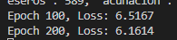

# PC3 NLP Cuantización de vectores de palabras en arquitecturas RNN profundas para optimización de modelos

El siguiente código utiliza los siguientes módulos propìos:

- `get_corpus`: para descargar y procesar el corpus.
- `word2vec`: para procesar y generar embeddings de palabras.
- `wordVectorQuantization`: para cuantizar los vectores de palabras.
- `rnn`: para entrenar una RNN de secuencias.

### Descripción Paso a Paso

1. **Carga y Preprocesamiento del Corpus**

Primero se descarga y preprocesa el corpus de texto que se utilizará para entrenar los embeddings de palabras. El corpus se obtiene de un archivo llamado `eswiki-latest-pages-articles.txt`, el cual contiene una gran cantidad de texto en español. Para hacer esto, se utiliza la función `preprocess_corpus_v2()` para dividir el corpus en lotes manejables:

```python
corpus_path = "corpus/eswiki-latest-pages-articles.txt"
corpus = preprocess_corpus_v2(corpus_path, batch_size=5000)
print(len(corpus))
```

2. **Entrenamiento de Word2Vec**

Se utiliza Word2Vec para entrenar un modelo que transforma las palabras en vectores (embeddings). Estos vectores permiten representar palabras en un espacio vectorial, donde las palabras con significados similares están más cerca. Para ello, se utiliza `Word2vecProcessor`:

```python
processor = Word2vecProcessor(vector_size=100, window=5, min_count=1, sg=1)
processor.train_word2vec(corpus)
processor.save_model(output_model_path)
```

3. **Cuantización de Embeddings**

Para reducir la complejidad de los embeddings generados, se realiza la cuantización de estos vectores. Se utiliza `EmbeddingQuantizer` para agrupar los embeddings en 1500 clusters utilizando k-means. Esta cuantización permite simplificar la información almacenada y acelerar el entrenamiento de la RNN, permitiendo así la optimización del modelo:

```python
embeddings = {word: processor.get_vector(word) for word in processor.model.wv.index_to_key}
quantizer = EmbeddingQuantizer(num_clusters=n_clusters)
quantizer.fit(embeddings)
centroids = quantizer.get_centroids()
word_to_cluster = quantizer.get_quantized_embeddings(embeddings)
```

Luego, se guarda un diccionario que contiene las relaciones entre palabras y clusters, así como los centroides obtenidos:

```python
dictionary = {
    "word_to_cluster": word_to_cluster,
    "cluster_to_word": {v: k for k, v in word_to_cluster.items()},
    "centroids": centroids
}
with open(dictionary_path, "wb") as f:
    pickle.dump(dictionary, f)
```

4. **Entrenamiento de la RNN**

La RNN se entrena para generar secuencias de texto. Para ello, se crea un lote de secuencias de entrada y sus respectivos objetivos a partir del corpus cuantizado:

```python
input_batch, target_batch = Sequence_RNN.make_batch(corpus, word_to_cluster, seq_len)
```

La RNN se define con la matriz de embeddings cuantizados como capa de entrada. Se entrena el modelo con 1000 épocas, imprimiendo el progreso cada 100 épocas y guardando el modelo cada 250 épocas:

```python
output_dim = len(centroids)
model = Sequence_RNN(embedding_matrix=centroids, hidden_dim=n_hidden, output_dim=output_dim)
model.train_model(input_batch, target_batch, num_epochs=epochs, print_every=100, save_every=250, save_path="model/")
```



5. **Guardado del Modelo**

   Una vez finalizado el entrenamiento, el modelo RNN se guarda para su posterior uso:

   ```python
   with open(output_rnn_model_path, "wb") as f:
       pickle.dump(model, f)
   print(f"Modelo RNN guardado en {output_rnn_model_path}")
   ```

6. **Generación de Secuencias**

   Finalmente, se utiliza el modelo entrenado para generar una secuencia de texto a partir de una cadena de entrada. La secuencia se genera utilizando un parámetro de temperatura para controlar la aleatoriedad:

   ```python
   cad = "el curso de la universidad"
   generated_seq = model.generate_sequence(cad, cluster_to_word, word_to_cluster, max_length=15, temperature=1.0)
   print("Secuencia generada:", generated_seq)
   ```


### Explicación del Código de la Clase `Sequence_RNN`

La clase `Sequence_RNN` define una red neuronal recurrente para trabajar con las secuencias generadas a partir de los embeddings cuantizados. A continuación se explica su funcionamiento:

1. **Constructor (`__init__`)**

El constructor inicializa la RNN utilizando los embeddings cuantizados como capa de entrada. Los pasos clave son:

- Crear un tensor a partir de la matriz de embeddings (`embedding_matrix`) y definir una capa de embeddings (`nn.Embedding`) que utiliza los vectores preentrenados.
- Definir una capa RNN con `nn.RNN` que tiene como entrada el tamaño del embedding y como salida la dimensión oculta (`hidden_dim`).
- Definir una capa totalmente conectada (`nn.Linear`) que convierte la salida oculta de la RNN en el espacio de salida (`output_dim`).

   ```python
   def __init__(self, embedding_matrix, hidden_dim, output_dim):
       super(Sequence_RNN, self).__init__()
       embedding_tensor = torch.tensor(embedding_matrix, dtype=torch.float32)
       self.embedding = nn.Embedding.from_pretrained(embedding_tensor)
       self.rnn = nn.RNN(input_size=embedding_tensor.size(1), hidden_size=hidden_dim, batch_first=True)
       self.fc = nn.Linear(hidden_dim, output_dim)
   ```

2. **Forward Propagation (`forward`)**

La función `forward` define el paso hacia adelante de la RNN, que incluye:

- Obtener los embeddings de las secuencias de entrada (`X`).
- Pasar estos embeddings a través de la RNN para obtener una salida.
- Utilizar la última salida de la RNN para hacer una predicción a través de la capa totalmente conectada (`fc`).

```python
def forward(self, X):
    embeds = self.embedding(X)
    out, _ = self.rnn(embeds)
    out = self.fc(out[:, -1, :])
    return out
```

3. **Creación de Lotes de Entrenamiento (`make_batch`)**

   El método estático `make_batch` se utiliza para crear los lotes de entrenamiento a partir del corpus cuantizado. Se generan pares de secuencia de entrada (`input_batch`) y el siguiente token como objetivo (`target_batch`).

   ```python
   @staticmethod
   def make_batch(corpus, word_to_cluster, seq_len):
       input_batch = []
       target_batch = []
       for sentence in corpus:
           tokenized = [word_to_cluster[word] for word in sentence.split() if word in word_to_cluster]
           for i in range(len(tokenized) - seq_len):
               input_batch.append(tokenized[i:i + seq_len])
               target_batch.append(tokenized[i + seq_len])
       return torch.LongTensor(input_batch), torch.LongTensor(target_batch)
   ```

4. **Entrenamiento del Modelo (`train_model`)**

   El método `train_model` entrena la RNN utilizando `CrossEntropyLoss` como función de costo y el optimizador `Adam`. El modelo se guarda periódicamente para evitar pérdidas de progreso durante el entrenamiento:

   ```python
   def train_model(self, input_batch, target_batch, num_epochs=500, learning_rate=0.001, print_every=100, save_every=250, save_path="model/"):
       criterion = nn.CrossEntropyLoss()
       optimizer = torch.optim.Adam(self.parameters(), lr=learning_rate)

       if not os.path.exists(save_path):
           os.makedirs(save_path)

       for epoch in range(num_epochs):
           optimizer.zero_grad()
           output = self(input_batch)
           loss = criterion(output, target_batch)
           if (epoch + 1) % print_every == 0:
               print(f"Epoch {epoch + 1}, Loss: {loss.item():.4f}")
           loss.backward()
           optimizer.step()

           if (epoch + 1) % save_every == 0:
               model_save_path = os.path.join(save_path, f"rnn_epoch_{epoch + 1}.pkl")
               with open(model_save_path, "wb") as f:
                   pickle.dump(self, f)
               print(f"Modelo guardado en {model_save_path} después de {epoch + 1} épocas.")
   ```

5. **Generación de Secuencias (`generate_sequence`)**

   El método `generate_sequence` permite generar una secuencia de palabras a partir de una frase inicial (`start_string`). Utiliza la RNN para predecir el siguiente cluster, seleccionando el próximo valor en función de una distribución de probabilidad ajustada por un parámetro de temperatura:

   ```python
   def generate_sequence(self, start_string, cluster_to_word, word_to_cluster, max_length=10, temperature=1.0):
       self.eval()
       tokens = start_string.lower().split()
       start_sequence = [word_to_cluster[word] for word in tokens if word in word_to_cluster]

       if not start_sequence:
           raise ValueError("El string de entrada no contiene palabras válidas en el vocabulario.")

       generated = start_sequence[:]
       input_seq = torch.LongTensor([start_sequence])

       for _ in range(max_length - len(start_sequence)):
           with torch.no_grad():
               output = self(input_seq)
               probabilities = nn.functional.softmax(output / temperature, dim=1).squeeze()
               next_cluster = torch.multinomial(probabilities, num_samples=1).item()
               generated.append(next_cluster)
               input_seq = torch.LongTensor([generated[-len(start_sequence):]])

       result = [cluster_to_word[c] for c in generated if c in cluster_to_word]

       initial_context = tokens
       return initial_context + result[len(initial_context):]
   ```


### Explicación del Código de la Clase `EmbeddingQuantizer`

La clase `EmbeddingQuantizer` es responsable de la cuantización de los embeddings de palabras mediante el uso del algoritmo de k-means para agrupar palabras similares. A continuación se describe su funcionamiento:

1. **Constructor (`__init__`)**

El constructor inicializa el número de clusters y define los atributos necesarios para almacenar el modelo k-means, los centroides y las etiquetas de cada vector:

```python
def __init__(self, num_clusters=5):
    self.num_clusters = num_clusters
    self.kmeans = None
    self.centroids = None
    self.labels = None
```

2. **Ajuste del Modelo (`fit`)**

El método `fit` entrena el modelo k-means utilizando los embeddings de palabras proporcionados. Los embeddings se agrupan en `num_clusters` clusters. Se almacena el modelo entrenado, los centroides de los clusters y las etiquetas de cada embedding:

```python
def fit(self, embeddings):
    vectors = list(embeddings.values())
    self.kmeans = KMeans(n_clusters=self.num_clusters)
    self.labels = self.kmeans.fit_predict(vectors)
    self.centroids = self.kmeans.cluster_centers_
```

3. **Obtención de los Centroides (`get_centroids`)**

El método `get_centroids` devuelve los centroides de los clusters obtenidos tras entrenar el modelo k-means. Estos centroides se utilizarán como los nuevos embeddings cuantizados:

```python
def get_centroids(self):
    return self.centroids
```

4. **Cuantización de los Embeddings (`get_quantized_embeddings`)**

El método `get_quantized_embeddings` genera un diccionario que asigna cada palabra al índice del cluster correspondiente. Este diccionario (`word_to_cluster`) se utiliza para representar cada palabra por el índice del cluster al que pertenece:

```python
def get_quantized_embeddings(self, embeddings):
    word_to_cluster = {word: self.labels[i] for i, word in enumerate(embeddings.keys())}
    return word_to_cluster
```


### Conclusiones
Este código proporciona un enfoque eficiente para la optimización de modelos de procesamiento de lenguaje natural al cuantizar los embeddings de palabras y utilizar una RNN profunda para aprender la secuencia de las palabras. La cuantización de vectores permite reducir la carga computacional y mejorar la escalabilidad del modelo, haciéndolo más viable para aplicaciones de gran escala.

